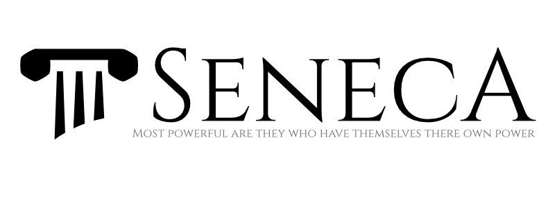

A Node.js toolkit for Micro-Service Architectures

#senecajs.org
This repo contains the documentation website for [Seneca.js][]. This documentation is available at
[senecajs.org][Seneca.js] or can be ran locally by cloning this repo and following the steps below.

## Run Locally
After cloning, you will need to get dependencies via npm,

```
npm install
```

Next simply build and serve to port `4000`,

```
npm run docs
```

## Contributing
Seneca and it's docs are __open projects__ and encourage participation. If you feel you can help in
any way, be it with examples, extra testing, tutorials, or new features please be our guest.

Please make all content changes in the [/src/pages][] folder. All changes are built just before we
redeploy the site so you only need to include changes in your PR. Upon your PR being accepted your
changes will be deployed.

## License
Copyright Seneca Contributors 2015, Licensed under [MIT][].

[MIT]: ./LICENSE
[/src/pages]: ./src/pages
[Seneca.js]: https://www.npmjs.com/package/seneca

[Seneca]: http://senecajs.org
[Metalsmith]: http://metalsmith.io
